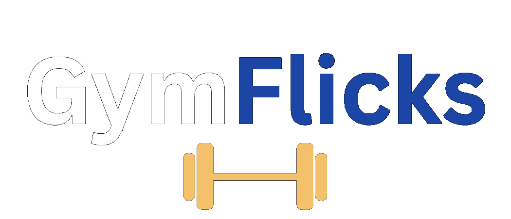

<p align="center">
  
</p>

<p align="center">A social fitness app with AI-powered workout planning</p>

## 📱 Features

-  **AI-Generated Workout Plans**  
  Select muscle groups and intensity to generate a customized weekly plan using Google Gemini AI.  Gemini AI wiill also generate motivation qoutes for you on your home screen!

- **Private Social Feed**  
  Share gym progress posts that are only visible to friends.

-  **Friend Request System**  
  Send, receive, and accept friend requests to build your private fitness network.

-  **Image Upload & Preview**  
  Upload gym selfies and preview before posting.

- **Upvote Support**  
  Users can upvote each post once to support their friends.


## ⚙️ Tech Stack

- **React Native** (via [Expo](https://expo.dev/))
- **TypeScript**
- **Firebase** 
- **Google Gemini API** 
- **Expo Router** 


## 🚀 Getting Started

### 1. Clone the Repo

```bash
git clone https://github.com/YOUR_USERNAME/gymflicks.git
cd gymflicks
