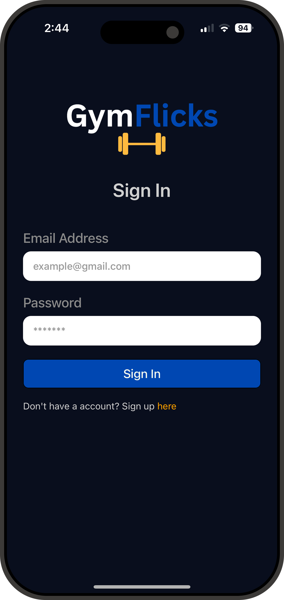
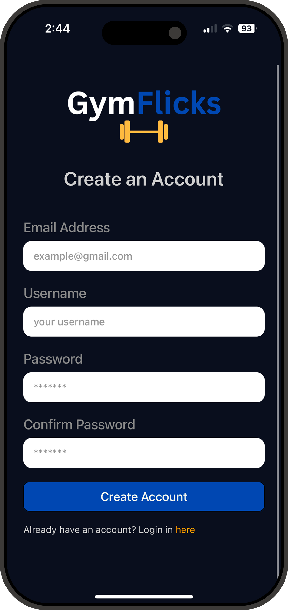
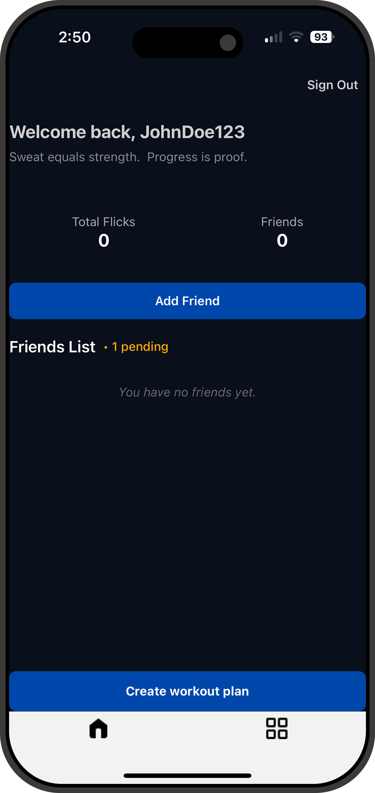
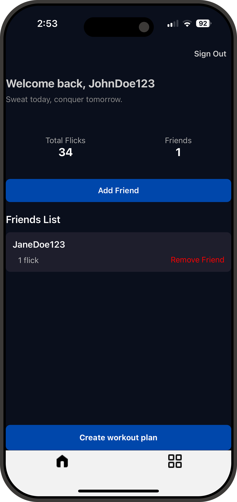
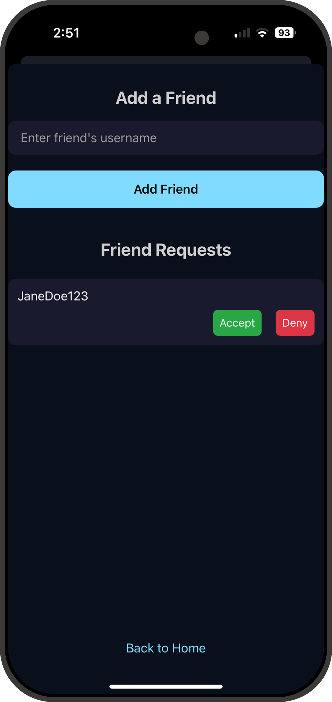
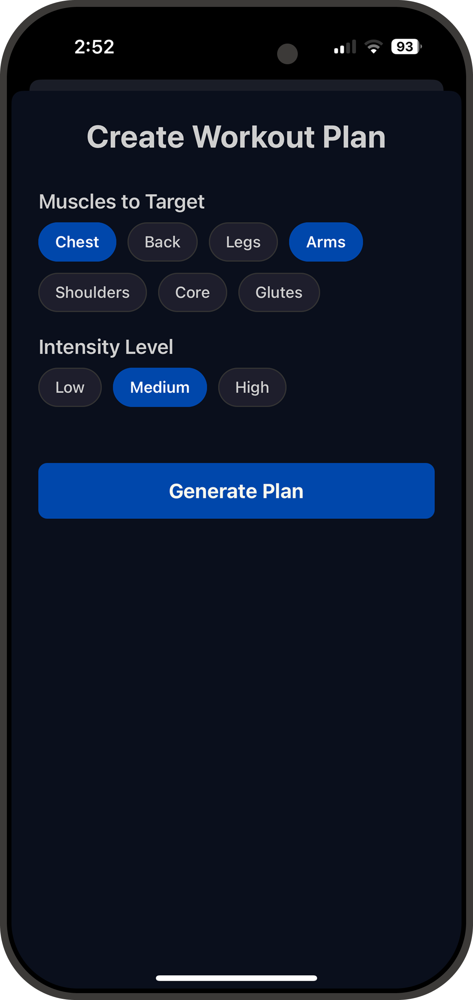
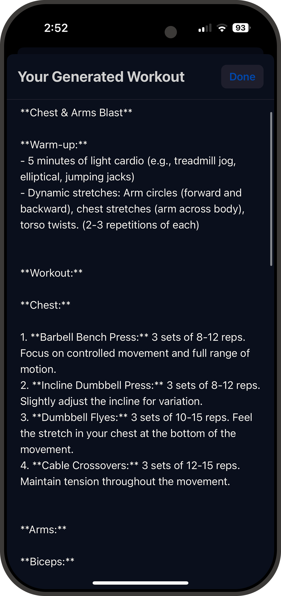
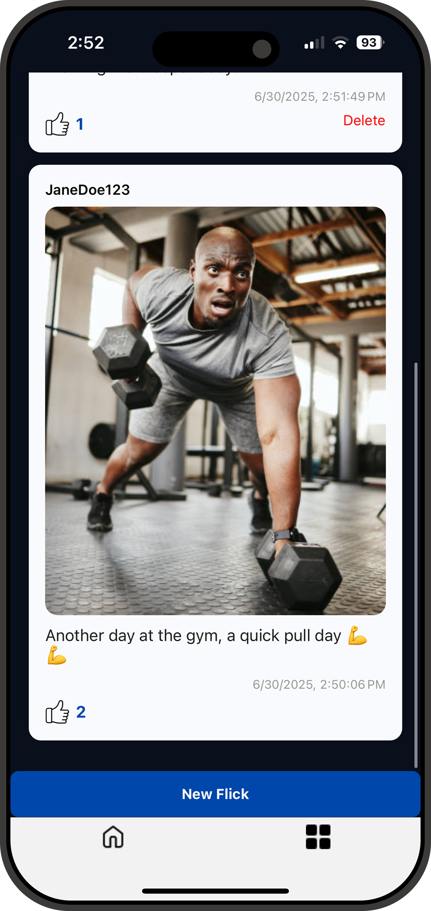

<p align="center">
  
</p>


<p align="center">A social fitness app with AI-powered workout planning</p>

## ✨ Features

-  **AI-Generated Workout Plans**  
  Select muscle groups and intensity to generate a customized weekly plan using Google Gemini AI.  Gemini AI wiill also generate motivation qoutes for you on your home screen!

- **Private Social Feed**  
  Share gym progress posts that are only visible to friends.

-  **Friend Request System**  
  Send, receive, and accept friend requests to build your private fitness network.

-  **Image Upload & Preview**  
  Upload gym selfies and preview before posting.

- **Upvote Support**  
  Users can upvote each post once to support their friends.


## ⚙️ Tech Stack

- **React Native** (via [Expo](https://expo.dev/))
- **TypeScript**
- **Firebase** 
- **Google Gemini API** 
- **Expo Router** 

## 📱 Images

### 🔐 Sign In / Sign Up

Easily create an account or log in to connect with friends and start building your fitness journey.

<p align="center">
  
  &nbsp;&nbsp;&nbsp;&nbsp;&nbsp;&nbsp;&nbsp;&nbsp;
  
</p>

---

### 🤝 Add and Remove Friends

View your friends list, accept requests, or add new gym buddies.

<p align="center">
  
  &nbsp;&nbsp;&nbsp;&nbsp;&nbsp;&nbsp;&nbsp;&nbsp;
  
  &nbsp;&nbsp;&nbsp;&nbsp;&nbsp;&nbsp;&nbsp;&nbsp;
  
</p>

---

### 💪 AI Workout Plans & Flick Feed

Generate intelligent plans and check out friends' workouts.

<p align="center">
  
  &nbsp;&nbsp;&nbsp;&nbsp;&nbsp;&nbsp;&nbsp;&nbsp;
  
  &nbsp;&nbsp;&nbsp;&nbsp;&nbsp;&nbsp;&nbsp;&nbsp;
  
</p>


## 🚀 Getting Started

### 1. Clone the Repo

```bash
git clone https://github.com/YOUR_USERNAME/gymflicks.git
cd gymflicks
```
### 2. Install dependencies

```bash
npm install
```


## 🔑 API Keys & Environment Setup

To run this app locally, you need to set up several API keys and environment variables:

### Required API Keys

| Service             | Purpose                                    | How to Get It                                    |
|---------------------|--------------------------------------------|-------------------------------------------------|
| **Firebase**        | Authentication and Firestore database      | Create a Firebase project at [Firebase Console](https://console.firebase.google.com) and get your config keys |
| **Google Gemini API**| AI-based workout plan generation            | Enable Google Gemini API in [Google Cloud Console](https://console.cloud.google.com) and create API credentials |

### Setup Instructions

1. Create a `.env` file in the root of your project (this file should be gitignored).

2. Add your keys and config variables, for example:

    ```env
    FIREBASE_API_KEY=your_firebase_api_key_here
    FIREBASE_AUTH_DOMAIN=your_project.firebaseapp.com
    FIREBASE_PROJECT_ID=your_project_id
    FIREBASE_STORAGE_BUCKET=your_project.appspot.com
    FIREBASE_MESSAGING_SENDER_ID=your_sender_id
    FIREBASE_APP_ID=your_firebase_app_id

    GOOGLE_GEMINI_API_KEY=your_google_gemini_api_key_here
    ```

3. Make sure your app’s code reads these environment variables properly (e.g., using `react-native-dotenv` or Expo’s built-in support).

4. Restart your development server after adding environment variables.
